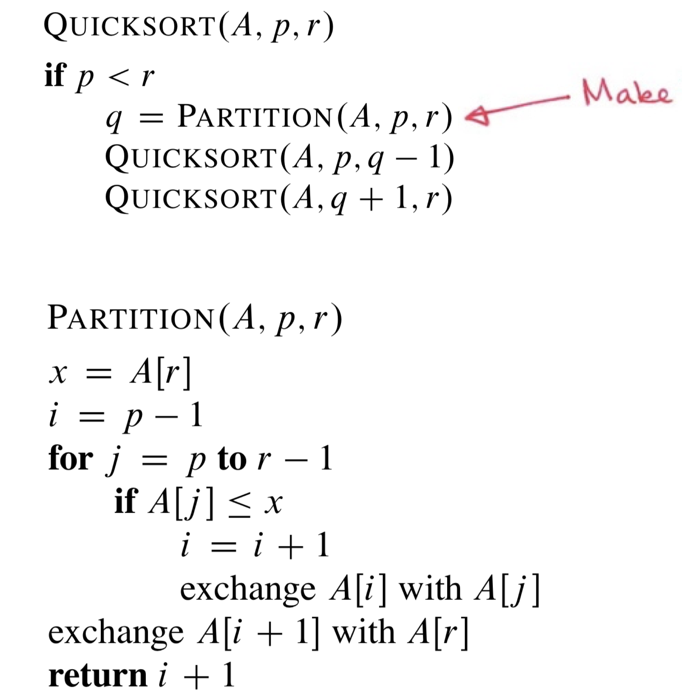
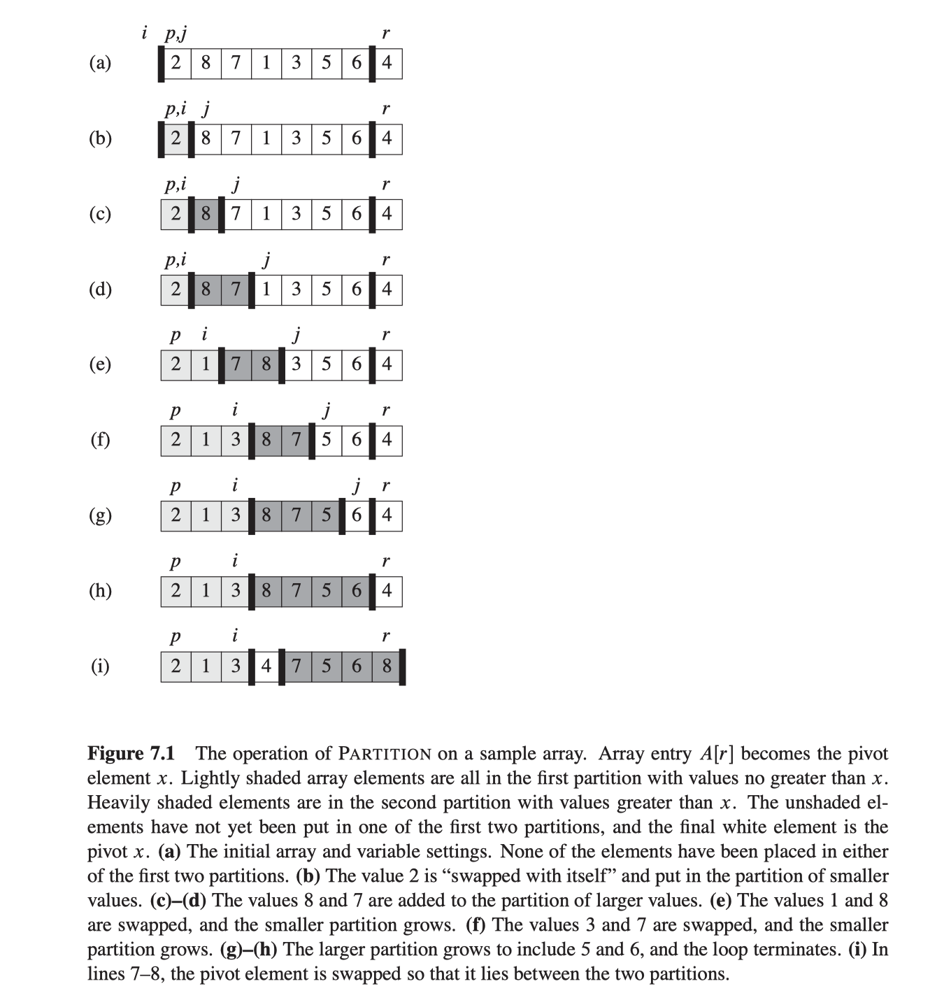

# Quick Sort

Quicksort is a divide and conquer algorithm. Quicksort first divides a large array into two smaller sub-arrays: the low elements and the high elements. Quicksort can then recursively sort the sub-arrays. 

1. Pick an element, called a **pivot**, from the array.

2. **Partitioning**: reorder the array so that all elements with values less than the pivot come before the pivot, while all elements with values greater than the pivot come after it (equal values can go either way). After this partitioning, the pivot is in its final position. This is called the partition operation.

3. **Recursively** apply the above steps to the sub-array of elements with smaller values and separately to the sub-array of elements with greater values.

## First Method:

Use two seperate array to store those partitions. And then combine them.
As [quick_sort_divideConquer.py](quick_sort_divideConquer.py)

The pseudocode：
```python
 function quicksort(q)
 {
     var list less, pivotList, greater
     if length(q) ≤ 1 
         return q
     else 
     {
         select a pivot value pivot from q
         for each x in q except the pivot element
         {
             if x < pivot then add x to less
             if x ≥ pivot then add x to greater
         }
         add pivot to pivotList
         return concatenate(quicksort(less), pivotList, quicksort(greater))
     }
 }
 ```

Cons:

It takes $$\Omega (n)$$ place to store it.


## Second Method (in place):

It only takes O(log n) to store it at best case.
  
Partition and then swap, so we don't need seperate arrays *less* and *more* (in first method) to store them, which helps to save space.

Refer to [quick_sort_inPlace.py](quick_sort_inPlace.py)

Reference:

1. Vedio from author. It has few problem. https://www.youtube.com/watch?v=SLauY6PpjW4
2. Vedio from Derek Banas. https://www.youtube.com/watch?v=mN5ib1XasSA (Also not perfect, it changes the pivot frequently after 8:24. It uses the left pointer or right pointer as pivot which is confused.)

## Third, follow "*Introduction to Algorithm*":

We always pick the last element as the pivot. The array is A[p..r]. `p` is the first element of the array which you want to sort, while `r` is the last one.



In order to sort an array, the first time to call Quicksort() should be `quicksort(A, 1, A.length)`. 

`x = A[r]` gets the pivot value.

In the for loop we only need to deal with the situation when `A[j]<=x`. So this version is simplest in code.


