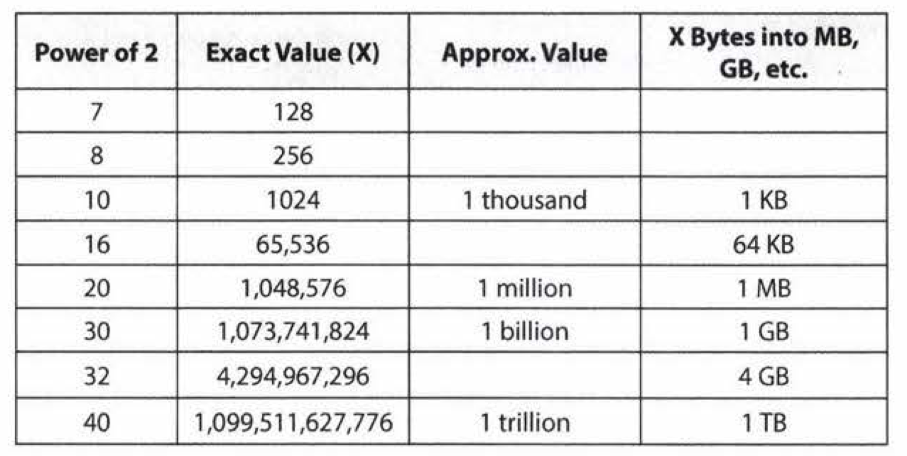

# VII.  Technical questions

## **7.1 How to Prepare**

Many candidates just read through problems and solutions. That's like trying to learn calculus by reading a problem and its answer. You need to practice solving problems. Memorizing solutions won't help you much.

For each problem in this book (and any other problem you might encounter), do the following:

1. **Try to solve the problem on your own**. Hints are provided at the back of this book, but push yourself to develop a solution with as little help as possible. Many questions are designed to be tough-that's okay! When you're solving a problem, make sure to think about the space and time efficiency.

2. **Write the code on paper**. Coding on a computer offers luxuries such as syntax highlighting, code completion, and quick debugging. Coding on paper does not. Get used to this-and to how slow it is to write and edit code-by coding on paper.

3. **Test your code-on paper**. This means testing the general cases, base cases, error cases, and so on. You'll need to do this during your interview, so it's best to practice this in advance.

4. **Type your paper code as-is into a computer**. You will probably make a bunch of mistakes. Start a list of all the errors you make so that you can keep these in mind during the actual interview.

In addition, try to do as many mock interviews as possible. You and a friend can take turns giving each other mock interviews. Though your friend may not be an expert interviewer, he or she may still be able to walk you through a coding or algorithm problem. You'll also learn a lot by experiencing what it's like to be an interviewer.

----

## **7.2 Baseline of knowledge**

### 7.2.1 Core Data Structures, Algorithms, and Concepts

A list of the absolute, **must-have** knowledge:

|Data Structures|Algorithms|Concepts|
|-|-|-|
||
|Linked Lists|Breadth-First Search|Bit Manipunation|
|Trees, Tries & Graphs|Depth-First Search|Memory (Stack vs. Heap)|
|Stacks & Queues|Binary Search|Recursion|
|Heaps|Merge Sort|Dynamic Programming|
|Vectors / ArrayLists|Quick sort|Big O Time & Space|
|**Hash Tables**|||
||

For each of these topics, make sure you understand how to use and implement them and, where applicable, the space and time complexity.

In particular, **hash tables** are an extremely important topic. Make sure you are very comfortable with this data structure.

### 7.2.2 Powers of 2 Table

The table below is useful for many questions involving **scalability** or any sort of **memory limitation**. Memorizing this table isn't strictly required, but it can be useful. You should at least be comfortable deriving it.

------

## 7.3 Walking throught a problem

(这一节还是很吃惊的，没想到这个步骤是这样！一定要记住！)

1. **Listen to all information**
   - Mentally recorded any unique information in the problem.
   - If you stuck, ask yourself if use all information.
2. **Draw an example. special? Big enough?**
    You want to create an example that is:
   - Specific. It should use real numbers or strings (if applicable to the problem).
   - Sufficiently large. Most examples are too small, by about 50%.
   - Not a special case. Be careful. It's very easy to inadvertently draw a special case. If there's any way your example is a special case (even if you think it probably won't be a big deal), you should fix it.
3. **Get a *brute-force* solution as soon as possible. State a naive algorithm and its ***runtime***, then optimize from there.**
4. **Optimize**. 确保使用了所有信息，尝试新的例子，手动走一遍，手动走一遍错例，Make a time vs. space tradeoff. Precompute information (reorganize data to save time in the long run). **Hash tables** are especially useful!
5. **Walk Through before coding!**
   - Make sure that you get it as close to "perfect" in the beginning as possible.
6. **Implement. Write beautiful code.** 
   Beautiful code means:
   - Modularized code. Just pretend you have a function initIncrementalMatrix (int size). Fill in the details later if you need to.
   - Error checks. Add a todo and then just explain out loud what you'd like to test.
   - Use other classeslstructs where appropriate. Return a StartEndPair (or possibly Range) objects instead of a 2-dimentional array.Just pretend it exists and deal with the details later if you have time.
   - Good variable names.
   - If you see something you can refactor later on, then explain this to your interviewer and decide whether or not it's worth the time to do so.
   - If you get confused (which is common), go back to your example and walk through it again.
7. **TEST**. 概念测试，特值测试，数学/空node测试，小样例大样例测试。
   - Start with a "conceptual" test. A conceptual test means just reading and analyzing what each line of code does. Think about it like you're explaining the lines of code for a code reviewer. Does the code do what you think it should do?
   - Weird looking code. Double check that line of code that says x = length - 2. Investigate that for loop that starts at i = 1. While you undoubtedly did this for a reason, it's really easy to get it just slightly wrong.
   - Hot spots. You've coded long enough to know what things are likely to cause problems. Base cases in recursive code. Integer division. Null nodes in binary trees. The start and end of iteration through a linked list. Double check that stuff.
   - Small test cases. This is the first time we use an actual, specific test case to test the code. Don't use that nice, big 8-element array from the algorithm part. Instead, use a 3 or 4 element array. 1t'lIlikely discover the same bugs, but it will be much faster to do so.
   - Special cases. Test your code against null or single element values, the extreme cases, and other special cases.
8. **Keep talking!**

## 7.4 Optimize & Solve Technique #1: Look for BUD

## 7.5 Optimize & Solve Technique #2: DIY (Do It Yourself)

## 7.6 Optimize & Solve Technique #2: DIY (Do It Yourself)

## 7.7 Optimize & Solve Technique #2: DIY (Do It Yourself)

## 7.8 Optimize & Solve Technique #5: Data Structure Brainstorm

