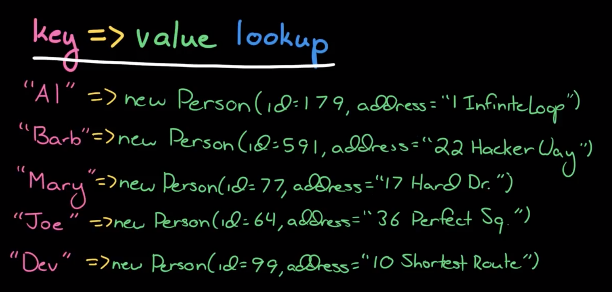

# IX.  Interview questions

# **9.1 Arrays and Strings**

Array questions and string questions are often interchangeable.

## 9.1.1 Hash Tables

**Hash table should be at the ***TOP*** of your mind when you meet a problem.**

[Vedio](https://www.youtube.com/watch?v=shs0KM3wKv8&list=PLI1t_8YX-Apv-UiRlnZwqqrRT8D1RhriX&index=13) explains hash table well by the author.

**Hash Table:** Maps keys to values for highly efficient lookup.

