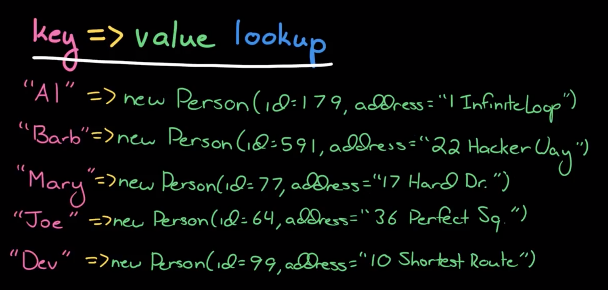
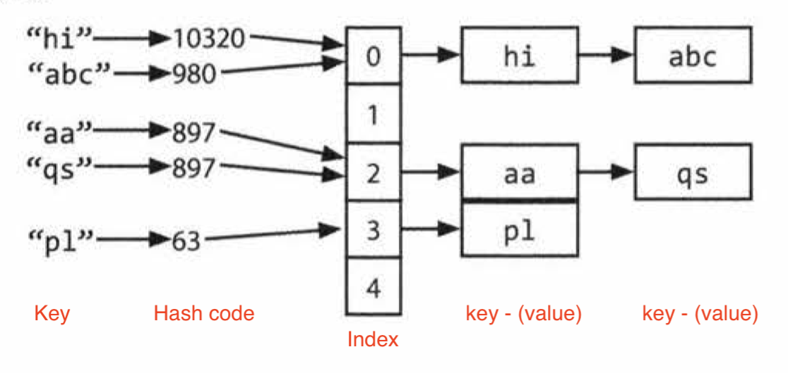

# IX.  Interview questions

# **9.1 Arrays and Strings**

Array questions and string questions are often interchangeable.

## 9.1.1 Hash Tables

**Hash table should be at the ***TOP*** of your mind when you meet a problem.**

[Vedio](https://www.youtube.com/watch?v=shs0KM3wKv8&list=PLI1t_8YX-Apv-UiRlnZwqqrRT8D1RhriX&index=13) explains hash table well by the author.

**Hash Table:** Maps keys to values for highly efficient lookup.



### Process:

**Key -> hash code -> index -> get value**:
Compute the hash code from the key, and then compute the index from the hash code. Then, search through the linked list for the value with this key.


### Running time:

If the number of collisions is very high, the **worst case** runtime is **O(N)**, where N is the number of keys. However, we generally assume a good implementation that keeps collisions to a minimum, in which case the lookup time is **O(1)**.

## **IQs 1.1 Is Unique**: 
Implement an algorithm to determine if a string has all unique characters. What if you cannot use additional data structures?

Hints: #44, # 117, # 132

- 44: Try a hash table.
- 117: Could a bit vector be useful?
- 132: Can you solve it in O(N log N) time? What might a solution like that look like?

------
## 9.1.2 ArrayList & Resizable Arrays

- **List**: 
**List** will grow as you append items.

- **Array**: 
**Arrays** are fixed length, like Java. The size is defined when you create the array.

- **ArrayList**: When you need an array-like data structure that offers **dynamic resizing**, you would usually use an ArrayList. An ArrayList is an array that resizes itself as needed while still providing O( 1) access. A typical implementation is that when the array is full, the array doubles in size. Each doubling takes 0 (n) time, but happens so rarely that its amortized insertion time is still 0 (1).
  
    (This is an **essential data structure for interviews**. Be sure you are comfortable with dynamically resizable arrays/lists in whatever language you will be working with.)

### Running time: Amortized insertion runtime 0(1)

When we increase the array to K elements, the array was previously halfthat size. Therefore, we needed to copy elements.

```
final capacity increase n/2 elements to copy 
previous capacity increase: n/4 elements to copy 
previous capacity increase : n/B elements to copy 
previous capacity increase: n/16 elements to copy
......
second capacity increase: 2 elements to copy 
first capacity increase: 1 element to copy
```

Therefore, the total number of copies to insert N elements is roughly N/2 + N/4+ N/8 + ... + 2 + 1, which is just less than N.

 
 ------

 ## 9.1.3 StringBuilder

To concatenate a list of strings, on each concatenation, a new copy of the string is created, and the two strings are copied over, character by character. The first iteration requires us to copy x characters. The second iteration requires copying 2x characters. The third iteration requires 3x, and so on. The total time therefore is 0 (x + 2x + ... + nx) . This reduces to **0(xn^2)**.
```java
String joinWords(String[] words) { 
    String sentence = ""; 
    for (String w : words) { 
        sentence = sentence + w;
    }
    return sentence;
}
```

**StringBuilder** can help you **avoid** this problem. StringBuilder simply creates a **resizable array** of all the strings, copying them back to a string only when necessary.
```java
String joinWords(String[] words) {  
    StringBuilder sentence new StringBuilder();  
    for (String w : words) { 
        sentence.append(w);
    }
    return sentence.toString();
}
```

 ------


## **IQs 1.2 Check Permutation**: 
Given two strings, write a method to decide if one is a permutation排列 of the other.

Hints: #1, #84, #122, #131

- 1: Describe what it means for two strings to be permutations of each other. Now, look at that definition you provided. Can you check the strings against that definition?
- 84: There is one solution that is 0 (N log N) time. Another solution uses some space, but isO(N) time.
- 122: Could a hash table be useful?
- 131: Can you solve it in O(N log N) time? What might a solution like that look like?


## **IQs 1.3 URLify**: 
Write a method to replace all spaces in a string with '%20'. You may assume that the string has sufficient space at the end to hold the additional characters, and that you are given the "true" length of the string. (Note: If implementing in Java, please use a character array so that you can perform this operation in place.)
```python
EXAMPLE:
Input: "Mr John Smith ",13
Output: "Mr%20John%20Smith"
```


Hints: #53, #7 78

- 53: It's often easiest to modify strings by going from the end of the string to the beginning.
- 118: You might find you need to know the number of spaces. Can you just count them?